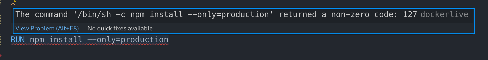
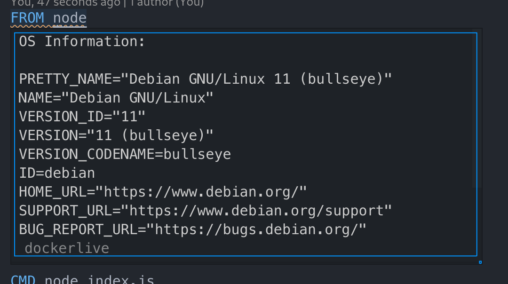

# Dockerlive

## Introduction

...

## Features

### Static Analysis Errors

The Dockerfile is scanned and any syntax errors are marked with a red underline.

### Image Build and Container Runtime Errors

If errors occur while building the image, the instruction responsible for the build failure is marked with a red underline. Hovering over the underline will show additional information.

### Changes to environment variables

If an environment variable's value is set in the Dockerfile but overwritten at runtime, the ENV instructions is marked with a blue underline. Hovering over the underline will show additional information.

### Processes running in the container 

By hovering over ENTRYPOINT/CMD instructions, the processes running inside the container are shown.

### Container performance statistics

By clicking the "CPU" button located in the top-right corner of the editor, a new tab containing data about the container's performance statistics is open.

This tab contains graphs which showcase CPU and memory usage inside the container. The tab also has 3 buttons at the top:

- Stop: stops the running container
- Restart: restarts the container
- Open Shell: opens an interactive shell inside the container

### Base image OS information

By hovering over the name of the image in the FROM instruction, it's possible to obtain information about the OS running inside the container.

### Layer Size and Build Time

Above every instruction, some information is displayed about the layer that instruction corresponds to:

- The time it took to build that layer
- The size of that layer

### Explore each layer's filesystem

By clicking the "FS" button located in the top-right corner of the editor, a new tab containing information about the container's filesystem is open.

At the top of this tab there is a dropdown that allows a user to switch between the different layers of the image. The "Up" and "Down" buttons can also be used for this purpose. Files changed in that layer are marked with a yellow square. It's also possible to click directories to expand them.

When hovering over an entry's permissions, a small table is shown to allow users to check the file's permissions in a more intuitive way.

### Container log output

The output of the `docker build` command and the output of the container itself are shown in the editor's output pane.

### Repair Opportunities

...

### Quick Fixes

...