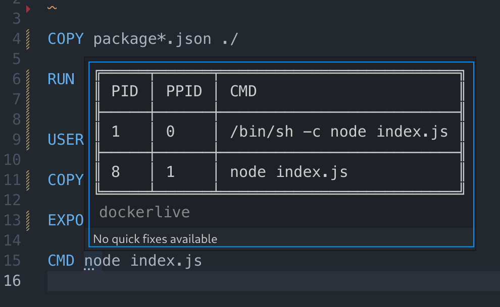

## Dockerlive

### Introduction

Dockerlive is a Visual Studio Code extension that aims to help developers who need to work with Dockerfiles. The extension continually builds an image using the Dockerfile that is currently being edited and offers several features that make Dockerfile development. You can find a list of the extension's features below.

### Features

#### Static Analysis Errors

The Dockerfile is scanned and any syntax errors are marked with a red underline. Hovering over the underlined region will show additional information.

#### Image Build and Container Runtime Errors

If errors occur while building the image, the instruction responsible for the build failure is marked with a red underline. Hovering over the underlined region will show additional information.

#### Processes running in the container 

By hovering over ENTRYPOINT/CMD instructions, the processes running inside the container are shown.

#### Base image OS information

By hovering over the name of the image in the FROM instruction, it's possible to obtain information about the OS running inside the container.

#### Layer Size and Build Time

Above every instruction, some information is displayed about the layer that instruction corresponds to:

- The time it took to build that layer
- The size of that layer

#### Repair Opportunities and Quick Fixes

When the extension detects problems that can be repaired, it marks them with a yellow underline (the environment variable problems are processed separately despite using an underline with the same color). Hovering over the underlined region will show additional information. The same section of the file may have multiple problems. 

These problems have corresponding quick fixes that can be applied. Quick fixes can be displayed by clicking the flashlight icon (or the quick fix option in the hover window) or by using the quick fix keyboard shortcut (Ctrl + .) while the cursor is in the underlined region. Afterwards, the fix can be applied by clicking it or pressing Enter while the fix is highlighted.

To detect some problems, the extension needs to generate an alternative Dockerfile in the background and compare it with the one being edited. Because of this, the first time a Dockerfile is opened, the extension will automatically start the generation. This process can take some time and the progress can be tracked in the bottom-right corner of the editor. Until this process is finished, no diagnostic information will be shown. Furthermore, until the generation is complete two files called "Dockerfile.strace" and "syscall.log" will show up in the current directory, these are temporary files that are required to perform the generation and should be **ignored**. These files will be deleted automatically once the generation is complete.

After the generation is complete, all the available repair opportunities will be presented.

#### Container log output

The output of the `docker build` command and the output of the container itself are shown in the editor's output pane. This pane is accessible through (View > Output) or through the keyboard shortcut [Ctrl+K Ctrl+H].

#### Notes

To continually build an image, Dockerlive creates a temporary file called "tmp.Dockerfile". This file should be **ignored**.